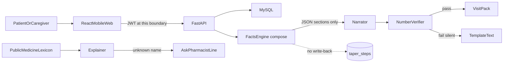

# RenalBuddy architecture and trust boundary

RenalBuddy is a visit log for nephrotic syndrome. The patient or caregiver types the clinic plan and the daily body. An optional narrator may only restate facts already computed. It does not choose a dose, label a dipstick as relapse, or write back into the taper.

Trust boundaries:

- Browser to API: HTTPS in production, JWT, CORS allow-list. Credentials are not sent to `*`.
- API to MySQL: server-side only. Patient journals are not used to train a model.
- Composer to taper table: read-only. Generation cannot insert a prescribed dose.
- Narrator to user: verifier discards invented numbers, dates, `relapse`, `remission`, and `you should`. Fail shows the template.
- Crisis note: hard-coded Singapore numbers. Not generated.

Five design trade-offs:

1. Web app versus iPhone camera. We refused dipstick AI so we would not become a diagnostic device. Type the square you already read.
2. Facts versus interpretation. First / last / highest protein is shown. Relapse is not named.
3. Outbound support versus in-app forum. Named organisations, including Singapore first. No patient-to-patient chat.
4. Template versus LLM. The template is the clinical core. The model is an optional narrator behind the verifier.
5. Patient-held log versus hospital system of record. No EMR write. No automated email to a consultant.

Spoken line for a demo: the model is a narrator of facts the patient already typed. If it invents a number, we throw the sentence away. It will never tell you that you have relapsed, and it will never change the dose your nephrologist wrote.
